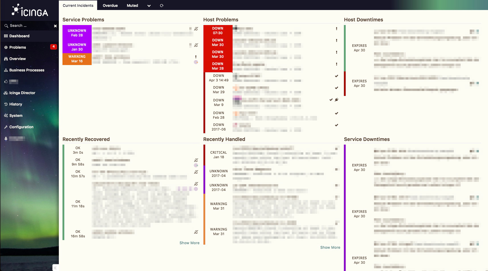
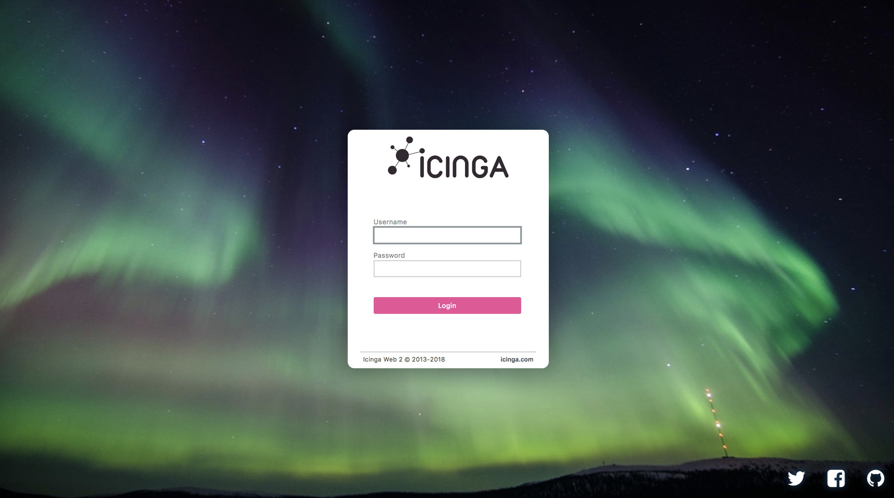

# This is theme Nordlicht for Icinga Web 2
I started this theme just for fun; then it was half completed, and I forgot it.

I was very surprised when I realized my colleagues using this incomplete theme; they say they love it so much, especially in case of desaster recovery, when the funny themes are more annoying than useful.

So I decided to create a stable (at least for the first) version. It's just a stupid CSS file with an image, but I'm not responsible for any of your damage anyways ;)

## Use it
Install and enable this theme like any other Icinga Web 2 module:

```bash
cd /usr/share/icingaweb2/modules
git clone https://github.com/sysadmama/icingaweb2-theme-nordlicht.git nordlicht
icingacli module enable nordlicht
```

Set it as global theme for all users to get the login image - if that's important for you.

## Contribution
Feel free to pull your ideas as well. 

## License
This theme is public domain. Use it and have fun.

## Screenshots
### Icinga Web 2 Dashboard


### Icinga Web 2 Login Screen

